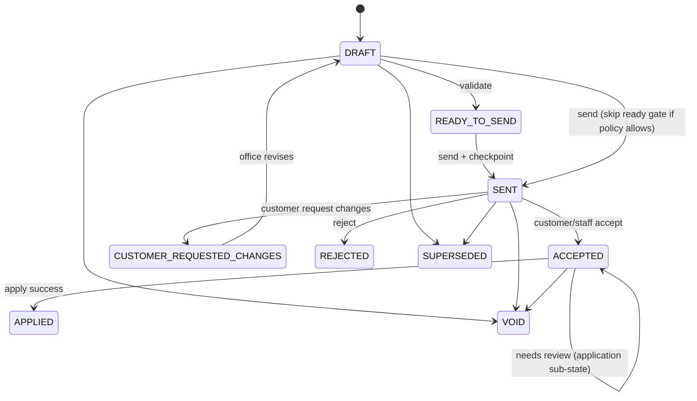

# Change Order Canon (Struxient v5)

> **Status:** Locked (Pass 1 ? architecture + schema proposal, 2026-06-24; **Pass 0 payment strategy**, 2026-06-24)
> **Scope:** Post-activation commercial and execution change on an active job.
> **Implementation map:** [`docs/plans/change-order-execution-delta-schema-proposal.md`](../plans/change-order-execution-delta-schema-proposal.md) ? [`docs/plans/change-order-payment-impact-schema-proposal.md`](../plans/change-order-payment-impact-schema-proposal.md) ? [`docs/source-of-truth-map.md`](../source-of-truth-map.md)
> **Related:** [locked-decisions-v1.md](./locked-decisions-v1.md) ?7 ? [quote-truth-and-checkpoints.md](./quote-truth-and-checkpoints.md) ? [execution-engine-canon.md](./execution-engine-canon.md) ?14 ? [invariants-and-decision-rules.md](./invariants-and-decision-rules.md) **I20**, **I26**

---

## Golden rule

> **A Change Order is a post-contract commercial delta plus a proposed execution delta against the active job plan ? not a new quote and not a full replacement execution plan.**

---

## 1. What a Change Order is

| Is | Is not |
|----|--------|
| Post-approval **append** of sold scope/price on an **active job** | A new quote or quote revision |
| A **commercial approval object** (customer-facing scope/price delta, reason, checkpoints) | A clone of quote Execution Review / whole-quote execution builder |
| A **proposed execution delta** stored against `Job.jobPlanVersion` at draft time | A silent rewrite of approved quote baseline checkpoints |
| Applied through an audited **`ExecutionPlanRevision`** after acceptance + validation | Implicit scope reconciliation at apply time without stored ops |

**Two-sided workflow:**

1. **Commercial approval** ? scope change, price delta (credit/charge/no-cost), **payment strategy and customer-facing payment terms** (when price impact), reason, send/accept/reject/request-changes, tokenized customer access, immutable accepted snapshot.
2. **Execution impact** ? proposed changes to the active job execution graph (scope items, tasks) stored as delta operations; applied only after validation. **Payment materialization follows commercial payment strategy at apply ? not execution-only JSON.**

---

## 2. Initial plan vs plan revision

| Moment | Mechanism | Truth created |
|--------|-----------|---------------|
| **Quote activation** | Copy-on-activate from `QuoteExecutionPlan` | Initial `JobScopeItem`, `JobTask`, `JobStage`, `JobPaymentRequirement` rows; `Job.jobPlanVersion = 1` |
| **Change Order apply** | Validated **execution delta** applied in one transaction | Mutations to job runtime rows + `ExecutionPlanRevision` audit + `jobPlanVersion++` |

**Must not:** treat Change Order drafting as building a parallel full execution plan like pre-activation quote planning.

**Must:** treat Change Order execution work as **delta operations** against the current active job graph.

---

## 3. Source-of-truth rules

### Immutable layers

- **Approved quote baseline** ? `QuoteCheckpoint` (SEND, APPROVAL) and issued quote rows **must not** be silently rewritten for customer-visible or monetary sold truth (**I20**).
- **Active job execution truth** ? `JobScopeItem` + `JobTask` + related runtime facts, versioned by **`Job.jobPlanVersion`**.

### Change Order immutability boundaries

| Phase | May mutate `JobScopeItem` / `JobTask`? |
|-------|----------------------------------------|
| `DRAFT`, `READY_TO_SEND`, `SENT`, `CUSTOMER_REQUESTED_CHANGES`, `ACCEPTED` (pre-apply) | **No** |
| Successful apply | **Yes** ? via validated delta only |
| `ACCEPTED` + `NEEDS_EXECUTION_REVIEW` / `APPLY_FAILED` | **No** ? office must revise delta or resolve conflicts first |

### Required stored facts on every Change Order

- **`baseJobPlanVersion`** ? `Job.jobPlanVersion` at CO **draft creation** (stale-plan anchor).
- **`executionDeltaJson`** ? proposed execution operations (MVP ops in ?6) before send and before apply.
- **Commercial lines** ? existing `ChangeOrderLine` rows (ADD / MODIFY / REMOVE on scope).
- **`paymentImpactJson`** ? when `priceDeltaCents !== 0`: customer-approved **payment strategy**, target resolution, customer terms, and apply preview (see ?11). **Must not** live only in `executionDeltaJson`.

### Payment source-of-truth (normative)

| Layer | Role | Mutability after quote approval |
|-------|------|--------------------------------|
| **`PaymentScheduleItem`** (quote) | Original sold payment **plan** at approval | **Immutable** ? never rewritten by CO apply |
| **`ChangeOrder.paymentImpactJson`** | Customer-approved **how/when** CO amount is collected | Stored on CO; frozen in ACCEPTANCE checkpoint |
| **`JobPaymentRequirement`** (job) | Runtime **collection truth** after activation | Mutated only by apply materialization, staff payment actions, or audited office corrections ? **never** silent quote edits |
| **`executionDeltaJson` payment ops** | **Legacy / transitional** ? see ?11.6 | **Must not** be sole carrier of customer payment terms |

**Must not:** double-count a CO amount (standalone row **and** milestone increase for the same delta).
**Must not:** mutate `PAID`, `WAIVED`, or `CANCELED` payment requirements during CO apply.
**Must:** fail apply or route to `NEEDS_EXECUTION_REVIEW` when credit exceeds unsettled balance or target requirement is unavailable.

### Apply gate (all must pass)

1. Commercial status allows apply (`ACCEPTED`, or org policy for zero-impact internal CO).
2. When `priceDeltaCents !== 0`: valid **`paymentImpactJson`** with MVP strategy; send/accept checkpoints captured payment terms.
3. **`job.jobPlanVersion`** matches apply contract (exact match or safe rebase per ?8).
4. **Execution delta validates** against current active entities (simulate-then-apply).
5. **Payment materialization validates** against current job payment requirements (targets unsettled, credit within balance).
6. **`ExecutionPlanRevision`** row written/updated through apply lifecycle.
7. Apply runs in **one transaction**; on failure, active job unchanged and application status records failure.

---

## 4. Lifecycle ? commercial status (`ChangeOrderStatus`)

Commercial workflow status. Distinct from execution apply sub-state (?5).

| Status | Meaning | Customer-visible? |
|--------|---------|-------------------|
| `DRAFT` | Office composing commercial lines + execution delta | No |
| `READY_TO_SEND` | Commercial + execution delta pass pre-send validation | No |
| `SENT` | Issued to customer; SEND checkpoint captured | Yes (token link) |
| `CUSTOMER_REQUESTED_CHANGES` | Customer feedback loop; CO not accepted | Yes |
| `ACCEPTED` | Customer or staff recorded acceptance; ACCEPTANCE checkpoint when customer path | Yes |
| `APPLIED` | Execution delta successfully applied to job | Yes (historical) |
| `REJECTED` | Office or customer declined | Optional audit |
| `VOID` | Office voided before apply | No |
| `SUPERSEDED` | Replaced by a newer CO revision on same intent | No |

**Transitions (normative):**



**Customer re-approval (locked ?7):** default **required** when CO has **price impact** (`priceDeltaCents !== 0`) or material customer-visible scope change. Zero-dollar internal scope changes may skip send per org policy ? must still store execution delta and pass validation before apply.

**Must not:** apply from `DRAFT` when customer re-approval is required by policy.

---

## 5. Lifecycle ? execution apply status (`ChangeOrderApplicationStatus`)

Sub-state for **execution application** while commercial status is `ACCEPTED` (or after failed apply attempts). Prevents **ACCEPTED COs trapped** with no path forward.

| Status | Meaning |
|--------|---------|
| `NOT_APPLIED` | Default; no apply attempted or not yet eligible |
| `APPLIED` | Delta successfully applied (`ChangeOrderStatus` also `APPLIED`) |
| `APPLY_FAILED` | Apply attempted; transaction rolled back; error stored |
| `NEEDS_EXECUTION_REVIEW` | Accepted but stale/conflicted delta; **must not** auto-mutate job |

When `NEEDS_EXECUTION_REVIEW` or `APPLY_FAILED`, office revises `executionDeltaJson`, rebases against current plan, or voids/supersedes the CO.

---

## 6. Execution delta MVP operations

Stored in `executionDeltaJson` (schema versioned JSON). Operations are **proposed only** until apply.

| Operation | Target | Purpose |
|-----------|--------|---------|
| `ADD_SCOPE_ITEM` | `JobScopeItem` | New authorized scope (links to commercial ADD line) |
| `REMOVE_SCOPE_ITEM` | `JobScopeItem` | Remove/cancel scope (commercial REMOVE) |
| `MODIFY_SCOPE_ITEM` | `JobScopeItem` | Supersede/replace scope (commercial MODIFY) |
| `ADD_TASK` | `JobTask` | New runtime task (coverage for new/changed scope) |
| `CANCEL_TASK` | `JobTask` | Audited cancel when scope removed or scope change requires it |
| `MODIFY_TASK` | `JobTask` | Title, instructions, signals, proof requirements, stage, assignee role |
| `UPDATE_PAYMENT_REQUIREMENT` | `JobPaymentRequirement` | **Legacy only** ? see ?11.6; **replace** with commercial payment materializer |

**Deferred (post-MVP):** `REPLACE_TASK`, photo/document requirement ops as separate types (may fold into `MODIFY_TASK` payload initially), schedule/permit ops, sequence/blocker ops as first-class types.

**Payment materialization (Pass 0 lock):** CO apply **must not** rely on `UPDATE_PAYMENT_REQUIREMENT` in `executionDeltaJson` as the authoritative payment plan. Apply reads **`paymentImpactJson`** and materializes runtime rows per ?11.4.

### Per-operation shape (canonical JSON)

Every operation **must** include:

| Field | Required | Notes |
|-------|----------|-------|
| `opId` | Yes | Stable id within this CO delta |
| `type` | Yes | One of MVP ops above |
| `targetEntityType` | Yes | `JobScopeItem` \| `JobTask` \| `JobPaymentRequirement` \| `ChangeOrderLine` |
| `targetEntityId` | When modifying/removing | Must reference entity active at `baseJobPlanVersion` or resolvable via supersession chain |
| `payload` | When adding or modifying | Entity fields to create/update |
| `reason` | Yes | Human-readable; audit |
| `customerLabel` | No | Customer-facing label when shown on CO doc |
| `internalNote` | No | Staff-only |
| `requiresCustomerApproval` | No | Default derived from commercial line / price impact |
| `validation` | Derived | `{ ok: boolean, errors?: string[], warnings?: string[] }` ? computed at save/send/accept/apply; not authoritative stored truth except last-run snapshot optional in `lastApplyErrorJson` |

**Wrapper document:**

```typescript
// Illustrative ? authoritative schema in schema proposal doc
type ExecutionDeltaProposal = {
  schemaVersion: 1;
  baseJobPlanVersion: number; // must match ChangeOrder.baseJobPlanVersion
  summary?: string;
  operations: ExecutionDeltaOperation[];
};
```

---

## 7. Validation and conflict behavior

Validation **simulates** operations against current job scope + tasks (same pattern as `validateQuotePlanProposalForApply`, but job entities).

**Run at:** draft save, transition to `READY_TO_SEND`, send, accept, apply (re-run inside apply transaction).

### Stale plan (`job.jobPlanVersion !== changeOrder.baseJobPlanVersion`)

| Conflict class | Behavior |
|----------------|----------|
| **Safe** | Auto-rebase (e.g. target superseded ? follow chain; cancel already-canceled task ? no-op) then apply |
| **Unsafe** | Set `applicationStatus = NEEDS_EXECUTION_REVIEW`; **do not mutate job** |
| **Hard validation failure** | Set `applicationStatus = APPLY_FAILED`; store `lastApplyErrorJson` |

**Must not:** silently apply against wrong plan version or inactive entity ids.

### Coverage invariant (post-apply)

Active **execution-relevant** scope must be covered by non-canceled tasks ? reuse `validateScopeRevisionApplyGuards` after simulated apply.

---

## 8. ExecutionPlanRevision role

`ExecutionPlanRevision` is the **audited apply record**, not a post-hoc receipt only.

| Field | Rule |
|-------|------|
| `kind` | `JOB_EXECUTION_DELTA` for CO apply (legacy `SCOPE_RECONCILIATION` retained for backfill) |
| `changeOrderId` | Required link |
| `basePlanVersion` | From CO at apply time (may differ from `baseJobPlanVersion` if rebased ? both stored) |
| `resultingPlanVersion` | `job.jobPlanVersion` after successful apply |
| `proposalJson` | Full `executionDeltaJson` (+ apply metadata) |
| `status` | `DRAFT` (proposed on CO save) ? `ACCEPTED` (optional) ? `APPLIED` \| `APPLY_FAILED` \| `NEEDS_REVIEW` |

**Must:** create/update revision through CO lifecycle; **must not** only insert revision after successful mutation without prior proposed record.

---

## 9. Audit requirements

Events must be attributable (checkpoints, `JobActivity`, `CustomerPortalEvent`, or dedicated CO activity types).

| Event | Required artifact |
|-------|-------------------|
| CO draft created | `JobActivity` or CO audit row |
| CO sent | `ChangeOrderCheckpoint` SEND + portal event |
| CO viewed | `ChangeOrderView` + portal event (exists) |
| CO accepted | `ChangeOrderCheckpoint` ACCEPTANCE + portal event ? **must include** `paymentImpact` in snapshot when `priceDeltaCents !== 0` |
| CO requested changes | `ChangeOrderCheckpoint` REQUEST_CHANGES (proposed) + portal event |
| CO rejected | Status + activity |
| CO voided | Status + activity |
| CO apply attempted | Activity with `executionPlanRevisionId` |
| CO applied | `SCOPE_REVISION_APPLIED` or `CHANGE_ORDER_APPLIED` activity + revision `APPLIED` |
| CO apply failed | Activity + `applicationStatus = APPLY_FAILED` + `lastApplyErrorJson` |
| CO needs execution review | Activity + `applicationStatus = NEEDS_EXECUTION_REVIEW` |

Staff accept **must** write ACCEPTANCE checkpoint parity with customer accept (implementation gap today).

---

## 10. Permissions and UI placement

**Permissions:** reuse execution-plan permission keys until CO-specific keys ship (`approve_scope_revision`, `apply_scope_revision`) ? see [execution-aware-authorization-canon.md](./execution-aware-authorization-canon.md).

**UI placement (Pass 3 ? not Pass 1):**

| Surface | Role |
|---------|------|
| `/jobs/[jobId]/change-orders` | Primary CO workspace: **commercial composer (incl. payment strategy)** + execution impact delta panel |
| Job detail | Link ?Change scope (Change Order)? only ? not a second builder |
| Quote Execution Review | **Must not** host post-activation CO execution editing |
| Workstation | Attention for draft/sent/accepted/needs-review COs |
| `/co/[token]` | Customer commercial view + accept + request changes |

**Must not:** clone `quote-execution-plan-proposal-review-panel` or whole-quote AI planner into Change Orders. Optional future: **suggest execution delta from scope lines** ? outputs `executionDeltaJson` only (review-then-save).

---

## 11. Change Order payment strategy (commercial truth)

> **Core rule:** Change Order payment impact is **commercial / customer-approved truth**. It is stored on the Change Order, shown to the customer before acceptance, snapshotted at acceptance, and **materialized** into `JobPaymentRequirement` rows on apply ? not buried in execution-only delta JSON.

### 11.1 When payment strategy is required

| `priceDeltaCents` | Payment strategy |
|-------------------|------------------|
| `0` | **Not required** for payment rows ? no payment materialization on apply |
| `!== 0` | **Required before send** ? office selects strategy; customer must see terms before accept |

**Send gate:** price-impact COs **must not** transition to `SENT` without valid `paymentImpactJson` (strategy + customer terms + resolved preview).

**Accept gate:** customer and staff acceptance **must** snapshot payment terms in `ChangeOrderCheckpoint` ACCEPTANCE payload (same content customer saw at send, plus any office revision re-sent).

### 11.2 MVP payment strategies

Enum values (canonical string slugs):

| Strategy | Meaning | Typical use |
|----------|---------|-------------|
| `DUE_BEFORE_ADDED_WORK` | Additional amount due **before** added/changed work starts | Materials, high $, high-risk customer, special-order items |
| `ADD_TO_NEXT_UNPAID_PAYMENT` | Add delta to **next unsettled** job payment requirement | Job underway; next draw is soon |
| `ADD_TO_FINAL_PAYMENT` | Add delta to **final unsettled** payment requirement | Small change; trusted customer; near completion |
| `CREDIT_REMAINING_BALANCE` | Negative delta reduces **unsettled** balance (**final-first** default) | Scope reduction, allowance, price decrease |
| `DEPOSIT_NOW_REST_TO_FINAL` | Deposit (new CO-sourced `DUE` row) + remainder on **final unsettled** payment | Partial upfront, rest at final |
| `SPLIT_ACROSS_REMAINING_PAYMENTS` | Full delta distributed across eligible unsettled rows with **stored exact allocations** | Larger COs; payment plan review |
| `DEPOSIT_NOW_REST_SPLIT_ACROSS_REMAINING` | Deposit (new CO-sourced `DUE` row) + remainder split across eligible unsettled rows | Partial upfront + spread |

**Payment plan review (v2):** Office uses a visual payment plan table ? current job payments, CO amount, per-payment adjustments, generated customer terms, and apply preview. **Presets are starting points only**; office may toggle **Customize allocation** and edit the **CO change** amount on eligible rows. **Stored `allocations[]` in `paymentImpactJson` are commercial truth**. Apply uses stored values, not silent recalculation.

Payment Plan Review is a review/allocation workflow, not a magic dropdown. Strategy presets seed defaults; saved allocation truth controls apply behavior.

**Custom allocation (controlled):**

- Manual row edits switch the plan to **Custom allocation** (`allocationBasis: MANUAL`).
- Only the **CO change** amount per **eligible unsettled** row is editable.
- **Must not** manually edit current amount, payment title, status, due anchor, or customer terms text.
- `originPreset` / `originAllocationBasis` may be stored for audit; customer-facing copy stays plain English.
- Save/send blocked unless deposit + allocation adjustments **exactly equal** `priceDeltaCents`.
- Custom allocation is **not** a full accounting editor ? no partial payments, no freeform terms, no arbitrary payment creation beyond deposit strategies.

**Allocation basis** (split strategies): `ORIGINAL_PAYMENT_PERCENTAGES`, `CURRENT_REMAINING_AMOUNTS`, `EQUAL_SPLIT`, `MANUAL`. Automatic percentage split uses schedule-backed eligible rows only; CO/manual rows are excluded; fallback to current balances when percentage coverage is insufficient.

**Deferred (post-MVP):**
- `NO_IMMEDIATE_PAYMENT_REQUIREMENT` (contract value change without collection row)
- Stripe / invoice amount sync
- Partial-payment-aware allocations

**Legacy (transitional only):**

- `LEGACY_SEPARATE_PAYMENT_REVIEW` ? backfill marker for price-impact COs created before payment strategy shipped; **must not send** until office selects a real MVP strategy

### 11.3 Default suggestions (office UX ? not hardcoded apply rules)

Office may override before send. Suggestions are **derived at draft time** for convenience only:

- Next unsettled schedule-linked requirement exists ? suggest `ADD_TO_NEXT_UNPAID_PAYMENT`
- CO is large or flagged material-heavy ? suggest `DUE_BEFORE_ADDED_WORK`
- Job near completion (only final unsettled) ? suggest `ADD_TO_FINAL_PAYMENT`
- `priceDeltaCents < 0` ? suggest `CREDIT_REMAINING_BALANCE`

Stored strategy on CO always wins over suggestion.

### 11.4 Apply / materialization rules (MVP)

All materialization runs in the **same transaction** as scope/task delta apply. Audit via `JobActivity` + `ExecutionPlanRevision.modelProviderMeta` (before/after amounts, strategy, target ids).

#### `DUE_BEFORE_ADDED_WORK`

- **Create** new `JobPaymentRequirement`:
  - `amountCents = priceDeltaCents` (positive charge only)
  - `sourceChangeOrderId = changeOrder.id`
  - `status = DUE` (explicit due ? not orphan `PENDING` without anchor)
  - Optional `requiredBeforeStageId` when CO adds tasks in a known stage (blocks added work via existing payment-hold derivation when `blocksAddedWork` is true)
- **Must not** also increase an existing milestone for the same CO amount.

#### `ADD_TO_NEXT_UNPAID_PAYMENT`

- Resolve **next unsettled** requirement: earliest by schedule sort order / activation order among requirements where `status ? { PAID, WAIVED, CANCELED }`.
- Store resolved `targetPaymentRequirementId` in `paymentImpactJson` at send time; **re-validate at apply**.
- **Increase** `amountCents` on target by `priceDeltaCents`.
- **Fail apply** (or `NEEDS_EXECUTION_REVIEW`) if target is paid/waived/canceled at apply time or no unsettled target exists.

#### `ADD_TO_FINAL_PAYMENT`

- Resolve **final unsettled** requirement: unsettled requirement whose schedule anchor is `FINAL_BALANCE`, or last unsettled in sort order when no FINAL_BALANCE lineage exists (product rule documented in implementation).
- Store `targetPaymentRequirementId` at send; re-validate at apply.
- **Increase** target `amountCents` by `priceDeltaCents`.
- **Fail apply** if final payment already paid/waived/canceled or no final unsettled target exists.

#### `CREDIT_REMAINING_BALANCE`

- Apply `|priceDeltaCents|` credit against **unsettled** requirements, **final-first**, then remaining unsettled in reverse schedule order unless office specified otherwise in future canon.
- **Decrease** `amountCents` on each target; **never** create negative payable rows.
- If credit **exceeds** total unsettled balance ? **fail apply** or `NEEDS_EXECUTION_REVIEW` (manual review / waiver path).
- Record credit allocation in apply audit metadata.

#### `DEPOSIT_NOW_REST_TO_FINAL` (v2)

- **Positive** `priceDeltaCents` only.
- Office sets deposit amount; **create one** CO-sourced `DUE` row for deposit; **increase** final unsettled payment by remainder.
- If deposit equals full delta, collapse to `DUE_BEFORE_ADDED_WORK`.
- `depositAmountCents + allocation.adjustmentCents === priceDeltaCents`.

#### `SPLIT_ACROSS_REMAINING_PAYMENTS` (v2)

- **Positive** delta only. Eligible = unsettled (`status ? { PAID, WAIVED, CANCELED }`).
- Exact `allocations[]` stored at save; apply verifies drift and sets `newAmountCents` exactly.

#### `DEPOSIT_NOW_REST_SPLIT_ACROSS_REMAINING` (v2)

- Deposit CO-sourced `DUE` row + stored split allocations on remainder. Same sum and drift rules as above.

#### Zero-dollar CO

- No payment materialization.
- **Must not** include payment ops in execution delta.
- Internal no-work-impact confirmation is separate from payment impact: `priceDeltaCents = 0` does not imply "no execution impact."

### 11.8 Zero-dollar material/scope policy (product decision posture)

Current canon lock:

- Zero-dollar internal/admin note CO can remain internal and does not require customer approval.
- Zero-dollar COs with execution-impacting material/scope changes require explicit internal confirmation before apply.

Pending product decision (must be explicit before launch hardening):

- Whether zero-dollar customer-facing material/scope substitutions always require customer acknowledgement/approval, even when price does not change.

#### Double-count prevention (all strategies)

Each cent of `priceDeltaCents` is materialized **exactly once**:

- `DUE_BEFORE_ADDED_WORK` (or collapsed deposit-only): one new CO-sourced `DUE` row only.
- `ADD_TO_*`, `SPLIT_*`, `CREDIT_*`: adjustments on existing unsettled rows only (no deposit row).
- `DEPOSIT_NOW_*`: one deposit CO row **plus** adjustments for remainder; deposit + adjustments must sum to delta.

**Must not** apply the same CO amount twice.

### 11.5 Customer-facing rules (`/co/[token]`)

**Must show (when price impact):**

- Price delta and revised contract total
- Payment strategy in **plain English** (from `customerTermsText`, not internal enum slug)
- Due timing or affected payment milestone title
- Credit wording for negative deltas
- Whether payment is due before added work starts (when `DUE_BEFORE_ADDED_WORK` or deposit strategies)
- **Exact payment allocation** for split/deposit strategies (title + before/after from `resolvedPreview.allocationLines` ? no internal ids)

**Customer terms:** `customerTermsText` **must be generated** from stored allocation at save time. Office **must not** edit terms to contradict the allocation table.

**Must not show:**

- Internal payment op ids, `executionDeltaJson`, `jobPlanVersion`, `applicationStatus`, internal notes
- Payment implementation details (Stripe ids, staff-only target requirement ids unless rendered as customer-safe milestone name)

**Acceptance copy:** customer accepts **scope, revised amount, and payment terms** ? not amount alone.

Checkpoint SEND and ACCEPTANCE snapshots **must** embed the same customer-safe payment terms block.

### 11.6 Legacy behavior ? `UPDATE_PAYMENT_REQUIREMENT` (current code)

**Status:** minimal / **not production-ready** ? replace with strategy-driven materializer.

Current implementation (pre?Pass 1 payment):

- Auto-generates `UPDATE_PAYMENT_REQUIREMENT` in `executionDeltaJson` when `priceDeltaCents !== 0`
- On apply, **creates** a standalone `JobPaymentRequirement` (misnamed UPDATE ? always insert)
- Row is `PENDING`, no `sourcePaymentScheduleItemId`, no due anchor ? **never auto-due** under `isPaymentEffectivelyDue()`
- No customer-approved payment strategy or terms

**Canon decision (Pass 0):**

- **Remove** payment materialization from execution delta as authoritative path
- Apply uses **`paymentImpactJson` commercial materializer** at apply time
- `UPDATE_PAYMENT_REQUIREMENT` may remain temporarily for backward compatibility in parser tests but **must not** be generated for new COs once payment strategy ships
- Applied legacy COs remain historical fact; do not retroactively rewrite `JobPaymentRequirement` rows

### 11.7 UX placement ? payment strategy

Payment strategy editor belongs in the **commercial column** of the Change Order workspace ? adjacent to price delta and customer preview.

The commercial payment card **must answer:**

- How much changed?
- When is it due?
- Where does it go in the existing payment plan?
- Does it block added work?
- What will the customer see?
- What happens after acceptance / apply?

**Work Impact panel** may show a **read-only result summary** (e.g. ?Will add $500 to Progress Payment 2?) derived from `paymentImpactJson.resolvedPreview` ? **must not** be the primary editor for customer-approved payment terms.

**Warnings (office):**

- No unsettled payment requirement when strategy requires a target
- Target requirement paid/waived/canceled since send
- Credit exceeds remaining unsettled balance
- Attempt to send without strategy on price-impact CO

Schedule/permit/material timing notes remain internal until scheduling canon integration.

---

## 12. Stored vs derived (CO-specific)

| Concept | Stored | Derived |
|---------|--------|---------|
| CO commercial lines | `ChangeOrderLine` | Line diffs in UI |
| CO payment strategy & terms | `paymentImpactJson` (+ ACCEPTANCE checkpoint snapshot) | Default strategy suggestion, resolved preview at draft/send |
| Proposed execution delta | `executionDeltaJson` | Impact preview |
| Plan version anchor | `baseJobPlanVersion` | Stale banner vs `Job.jobPlanVersion` |
| Apply outcome | `applicationStatus`, `lastApplyErrorJson` | Ready-to-apply button state |
| Active job execution | `JobScopeItem`, `JobTask` | Readiness, coverage, workstation |
| Runtime payment changes from CO | `JobPaymentRequirement` mutations + `sourceChangeOrderId` | Payment due-ness via `isPaymentEffectivelyDue()` |
| Accepted commercial proof | `ChangeOrderCheckpoint` | Customer projection |

---

## Related canon

| Document | Topic |
|----------|--------|
| [execution-engine-canon.md](./execution-engine-canon.md) ?14 | CO in runtime engine |
| [quote-truth-and-checkpoints.md](./quote-truth-and-checkpoints.md) | Checkpoints vs working records |
| [customer-project-portal-canon.md](./customer-project-portal-canon.md) | Tokenized CO access |
| [templates-and-execution-planning.md](./templates-and-execution-planning.md) | Quote-time planning vs job revision |
| [workstation-canon.md](./workstation-canon.md) | CO attention items |

---

*Canon created 2026-06-24 ? Pass 1: Change Order = commercial delta + proposed execution delta; lifecycle, validation, audit, and UI boundaries.*
*Canon update 2026-06-24 ? Pass 0 payment: MVP payment strategies, commercial `paymentImpactJson`, materialization rules, customer terms, legacy `UPDATE_PAYMENT_REQUIREMENT` deprecation.*
*Supersedes implicit "scope reconciliation only" behavior and standalone orphan PENDING payment row pattern.*
*Canon update 2026-06-25 ? Custom allocation (MANUAL basis): presets as starting points, controlled CO-change edits, generated customer terms, exact-sum save/send gate.*
*Canon update 2026-06-27 ? Clarified Payment Plan Review posture, separated no-work-impact confirmation from payment impact, and marked zero-dollar customer-facing substitution policy as an explicit product decision.*
