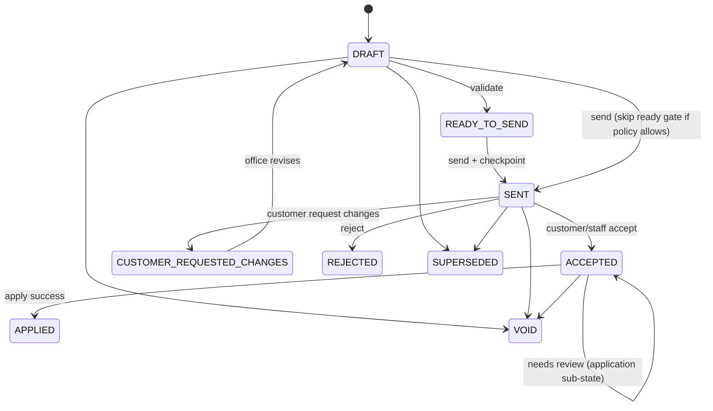

# Change Order Canon (Struxient v5)

> **Status:** Locked (Pass 1 — architecture + schema proposal, 2026-06-24)  
> **Scope:** Post-activation commercial and execution change on an active job.  
> **Implementation map:** [`docs/plans/change-order-execution-delta-schema-proposal.md`](../plans/change-order-execution-delta-schema-proposal.md) · [`docs/source-of-truth-map.md`](../source-of-truth-map.md)  
> **Related:** [locked-decisions-v1.md](./locked-decisions-v1.md) §7 · [quote-truth-and-checkpoints.md](./quote-truth-and-checkpoints.md) · [execution-engine-canon.md](./execution-engine-canon.md) §14 · [invariants-and-decision-rules.md](./invariants-and-decision-rules.md) **I20**, **I26**

---

## Golden rule

> **A Change Order is a post-contract commercial delta plus a proposed execution delta against the active job plan — not a new quote and not a full replacement execution plan.**

---

## 1. What a Change Order is

| Is | Is not |
|----|--------|
| Post-approval **append** of sold scope/price on an **active job** | A new quote or quote revision |
| A **commercial approval object** (customer-facing scope/price delta, reason, checkpoints) | A clone of quote Execution Review / whole-quote execution builder |
| A **proposed execution delta** stored against `Job.jobPlanVersion` at draft time | A silent rewrite of approved quote baseline checkpoints |
| Applied through an audited **`ExecutionPlanRevision`** after acceptance + validation | Implicit scope reconciliation at apply time without stored ops |

**Two-sided workflow:**

1. **Commercial approval** — scope change, price delta (credit/charge/no-cost), reason, send/accept/reject/request-changes, tokenized customer access, immutable accepted snapshot.
2. **Execution impact** — proposed changes to the active job execution graph (scope items, tasks, payment requirements) stored as delta operations; applied only after validation.

---

## 2. Initial plan vs plan revision

| Moment | Mechanism | Truth created |
|--------|-----------|---------------|
| **Quote activation** | Copy-on-activate from `QuoteExecutionPlan` | Initial `JobScopeItem`, `JobTask`, `JobStage`, `JobPaymentRequirement` rows; `Job.jobPlanVersion = 1` |
| **Change Order apply** | Validated **execution delta** applied in one transaction | Mutations to job runtime rows + `ExecutionPlanRevision` audit + `jobPlanVersion++` |

**Must not:** treat Change Order drafting as building a parallel full execution plan like pre-activation quote planning.

**Must:** treat Change Order execution work as **delta operations** against the current active job graph.

---

## 3. Source-of-truth rules

### Immutable layers

- **Approved quote baseline** — `QuoteCheckpoint` (SEND, APPROVAL) and issued quote rows **must not** be silently rewritten for customer-visible or monetary sold truth (**I20**).
- **Active job execution truth** — `JobScopeItem` + `JobTask` + related runtime facts, versioned by **`Job.jobPlanVersion`**.

### Change Order immutability boundaries

| Phase | May mutate `JobScopeItem` / `JobTask`? |
|-------|----------------------------------------|
| `DRAFT`, `READY_TO_SEND`, `SENT`, `CUSTOMER_REQUESTED_CHANGES`, `ACCEPTED` (pre-apply) | **No** |
| Successful apply | **Yes** — via validated delta only |
| `ACCEPTED` + `NEEDS_EXECUTION_REVIEW` / `APPLY_FAILED` | **No** — office must revise delta or resolve conflicts first |

### Required stored facts on every Change Order

- **`baseJobPlanVersion`** — `Job.jobPlanVersion` at CO **draft creation** (stale-plan anchor).
- **`executionDeltaJson`** — proposed execution operations (MVP ops in §6) before send and before apply.
- **Commercial lines** — existing `ChangeOrderLine` rows (ADD / MODIFY / REMOVE on scope).

### Apply gate (all must pass)

1. Commercial status allows apply (`ACCEPTED`, or org policy for zero-impact internal CO).
2. **`job.jobPlanVersion`** matches apply contract (exact match or safe rebase per §8).
3. **Execution delta validates** against current active entities (simulate-then-apply).
4. **`ExecutionPlanRevision`** row written/updated through apply lifecycle.
5. Apply runs in **one transaction**; on failure, active job unchanged and application status records failure.

---

## 4. Lifecycle — commercial status (`ChangeOrderStatus`)

Commercial workflow status. Distinct from execution apply sub-state (§5).

| Status | Meaning | Customer-visible? |
|--------|---------|-------------------|
| `DRAFT` | Office composing commercial lines + execution delta | No |
| `READY_TO_SEND` | Commercial + execution delta pass pre-send validation | No |
| `SENT` | Issued to customer; SEND checkpoint captured | Yes (token link) |
| `CUSTOMER_REQUESTED_CHANGES` | Customer feedback loop; CO not accepted | Yes |
| `ACCEPTED` | Customer or staff recorded acceptance; ACCEPTANCE checkpoint when customer path | Yes |
| `APPLIED` | Execution delta successfully applied to job | Yes (historical) |
| `REJECTED` | Office or customer declined | Optional audit |
| `VOID` | Office voided before apply | No |
| `SUPERSEDED` | Replaced by a newer CO revision on same intent | No |

**Transitions (normative):**



**Customer re-approval (locked §7):** default **required** when CO has **price impact** (`priceDeltaCents !== 0`) or material customer-visible scope change. Zero-dollar internal scope changes may skip send per org policy — must still store execution delta and pass validation before apply.

**Must not:** apply from `DRAFT` when customer re-approval is required by policy.

---

## 5. Lifecycle — execution apply status (`ChangeOrderApplicationStatus`)

Sub-state for **execution application** while commercial status is `ACCEPTED` (or after failed apply attempts). Prevents **ACCEPTED COs trapped** with no path forward.

| Status | Meaning |
|--------|---------|
| `NOT_APPLIED` | Default; no apply attempted or not yet eligible |
| `APPLIED` | Delta successfully applied (`ChangeOrderStatus` also `APPLIED`) |
| `APPLY_FAILED` | Apply attempted; transaction rolled back; error stored |
| `NEEDS_EXECUTION_REVIEW` | Accepted but stale/conflicted delta; **must not** auto-mutate job |

When `NEEDS_EXECUTION_REVIEW` or `APPLY_FAILED`, office revises `executionDeltaJson`, rebases against current plan, or voids/supersedes the CO.

---

## 6. Execution delta MVP operations

Stored in `executionDeltaJson` (schema versioned JSON). Operations are **proposed only** until apply.

| Operation | Target | Purpose |
|-----------|--------|---------|
| `ADD_SCOPE_ITEM` | `JobScopeItem` | New authorized scope (links to commercial ADD line) |
| `REMOVE_SCOPE_ITEM` | `JobScopeItem` | Remove/cancel scope (commercial REMOVE) |
| `MODIFY_SCOPE_ITEM` | `JobScopeItem` | Supersede/replace scope (commercial MODIFY) |
| `ADD_TASK` | `JobTask` | New runtime task (coverage for new/changed scope) |
| `CANCEL_TASK` | `JobTask` | Audited cancel when scope removed or scope change requires it |
| `MODIFY_TASK` | `JobTask` | Title, instructions, signals, proof requirements, stage, assignee role |
| `UPDATE_PAYMENT_REQUIREMENT` | `JobPaymentRequirement` | CO price delta materialization / adjustment |

**Deferred (post-MVP):** `REPLACE_TASK`, photo/document requirement ops as separate types (may fold into `MODIFY_TASK` payload initially), schedule/permit ops, sequence/blocker ops as first-class types.

### Per-operation shape (canonical JSON)

Every operation **must** include:

| Field | Required | Notes |
|-------|----------|-------|
| `opId` | Yes | Stable id within this CO delta |
| `type` | Yes | One of MVP ops above |
| `targetEntityType` | Yes | `JobScopeItem` \| `JobTask` \| `JobPaymentRequirement` \| `ChangeOrderLine` |
| `targetEntityId` | When modifying/removing | Must reference entity active at `baseJobPlanVersion` or resolvable via supersession chain |
| `payload` | When adding or modifying | Entity fields to create/update |
| `reason` | Yes | Human-readable; audit |
| `customerLabel` | No | Customer-facing label when shown on CO doc |
| `internalNote` | No | Staff-only |
| `requiresCustomerApproval` | No | Default derived from commercial line / price impact |
| `validation` | Derived | `{ ok: boolean, errors?: string[], warnings?: string[] }` — computed at save/send/accept/apply; not authoritative stored truth except last-run snapshot optional in `lastApplyErrorJson` |

**Wrapper document:**

```typescript
// Illustrative — authoritative schema in schema proposal doc
type ExecutionDeltaProposal = {
  schemaVersion: 1;
  baseJobPlanVersion: number; // must match ChangeOrder.baseJobPlanVersion
  summary?: string;
  operations: ExecutionDeltaOperation[];
};
```

---

## 7. Validation and conflict behavior

Validation **simulates** operations against current job scope + tasks (same pattern as `validateQuotePlanProposalForApply`, but job entities).

**Run at:** draft save, transition to `READY_TO_SEND`, send, accept, apply (re-run inside apply transaction).

### Stale plan (`job.jobPlanVersion !== changeOrder.baseJobPlanVersion`)

| Conflict class | Behavior |
|----------------|----------|
| **Safe** | Auto-rebase (e.g. target superseded → follow chain; cancel already-canceled task → no-op) then apply |
| **Unsafe** | Set `applicationStatus = NEEDS_EXECUTION_REVIEW`; **do not mutate job** |
| **Hard validation failure** | Set `applicationStatus = APPLY_FAILED`; store `lastApplyErrorJson` |

**Must not:** silently apply against wrong plan version or inactive entity ids.

### Coverage invariant (post-apply)

Active **execution-relevant** scope must be covered by non-canceled tasks — reuse `validateScopeRevisionApplyGuards` after simulated apply.

---

## 8. ExecutionPlanRevision role

`ExecutionPlanRevision` is the **audited apply record**, not a post-hoc receipt only.

| Field | Rule |
|-------|------|
| `kind` | `JOB_EXECUTION_DELTA` for CO apply (legacy `SCOPE_RECONCILIATION` retained for backfill) |
| `changeOrderId` | Required link |
| `basePlanVersion` | From CO at apply time (may differ from `baseJobPlanVersion` if rebased — both stored) |
| `resultingPlanVersion` | `job.jobPlanVersion` after successful apply |
| `proposalJson` | Full `executionDeltaJson` (+ apply metadata) |
| `status` | `DRAFT` (proposed on CO save) → `ACCEPTED` (optional) → `APPLIED` \| `APPLY_FAILED` \| `NEEDS_REVIEW` |

**Must:** create/update revision through CO lifecycle; **must not** only insert revision after successful mutation without prior proposed record.

---

## 9. Audit requirements

Events must be attributable (checkpoints, `JobActivity`, `CustomerPortalEvent`, or dedicated CO activity types).

| Event | Required artifact |
|-------|-------------------|
| CO draft created | `JobActivity` or CO audit row |
| CO sent | `ChangeOrderCheckpoint` SEND + portal event |
| CO viewed | `ChangeOrderView` + portal event (exists) |
| CO accepted | `ChangeOrderCheckpoint` ACCEPTANCE + portal event |
| CO requested changes | `ChangeOrderCheckpoint` REQUEST_CHANGES (proposed) + portal event |
| CO rejected | Status + activity |
| CO voided | Status + activity |
| CO apply attempted | Activity with `executionPlanRevisionId` |
| CO applied | `SCOPE_REVISION_APPLIED` or `CHANGE_ORDER_APPLIED` activity + revision `APPLIED` |
| CO apply failed | Activity + `applicationStatus = APPLY_FAILED` + `lastApplyErrorJson` |
| CO needs execution review | Activity + `applicationStatus = NEEDS_EXECUTION_REVIEW` |

Staff accept **must** write ACCEPTANCE checkpoint parity with customer accept (implementation gap today).

---

## 10. Permissions and UI placement

**Permissions:** reuse execution-plan permission keys until CO-specific keys ship (`approve_scope_revision`, `apply_scope_revision`) — see [execution-aware-authorization-canon.md](./execution-aware-authorization-canon.md).

**UI placement (Pass 3 — not Pass 1):**

| Surface | Role |
|---------|------|
| `/jobs/[jobId]/change-orders` | Primary CO workspace: commercial composer + **execution impact delta panel** |
| Job detail | Link “Change scope (Change Order)” only — not a second builder |
| Quote Execution Review | **Must not** host post-activation CO execution editing |
| Workstation | Attention for draft/sent/accepted/needs-review COs |
| `/co/[token]` | Customer commercial view + accept + request changes |

**Must not:** clone `quote-execution-plan-proposal-review-panel` or whole-quote AI planner into Change Orders. Optional future: **suggest execution delta from scope lines** → outputs `executionDeltaJson` only (review-then-save).

---

## 11. Payment and schedule effects

- **Price delta:** `UPDATE_PAYMENT_REQUIREMENT` op and/or linked `JobPaymentRequirement.sourceChangeOrderId` created in same apply transaction as scope/task ops.
- **Non-zero delta without payment op:** apply **blocked** (existing `validateScopeRevisionPaymentImpact` invariant).
- **Schedule/permit/material:** out of MVP delta ops; note in `internalNote` until scheduling canon integration.

---

## 12. Stored vs derived (CO-specific)

| Concept | Stored | Derived |
|---------|--------|---------|
| CO commercial lines | `ChangeOrderLine` | Line diffs in UI |
| Proposed execution delta | `executionDeltaJson` | Impact preview |
| Plan version anchor | `baseJobPlanVersion` | Stale banner vs `Job.jobPlanVersion` |
| Apply outcome | `applicationStatus`, `lastApplyErrorJson` | Ready-to-apply button state |
| Active job execution | `JobScopeItem`, `JobTask` | Readiness, coverage, workstation |
| Accepted commercial proof | `ChangeOrderCheckpoint` | Customer projection |

---

## Related canon

| Document | Topic |
|----------|--------|
| [execution-engine-canon.md](./execution-engine-canon.md) §14 | CO in runtime engine |
| [quote-truth-and-checkpoints.md](./quote-truth-and-checkpoints.md) | Checkpoints vs working records |
| [customer-project-portal-canon.md](./customer-project-portal-canon.md) | Tokenized CO access |
| [templates-and-execution-planning.md](./templates-and-execution-planning.md) | Quote-time planning vs job revision |
| [workstation-canon.md](./workstation-canon.md) | CO attention items |

---

*Canon created 2026-06-24 — Pass 1: Change Order = commercial delta + proposed execution delta; lifecycle, validation, audit, and UI boundaries.*  
*Supersedes implicit “scope reconciliation only” behavior documented in code comments and investigation notes.*
