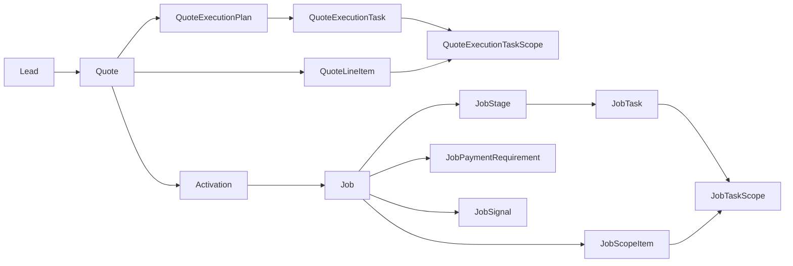

# Execution Engine Canon (Struxient v5)

> **Status:** Locked (post stabilization passes, May 2026)  
> **Scope:** Runtime execution contract from commercial scope on the quote through job activation, task/stage/signal execution, issues/recovery, payments, and Workstation attention.  
> **Implementation map:** [`docs/source-of-truth-map.md`](../source-of-truth-map.md)  
> **Historical audit:** [`docs/current-execution-engine-audit.md`](../current-execution-engine-audit.md) (read-only snapshot; this document is product authority)

---

## Golden rule

> **Line items define scope. Tasks drive execution. Stages organize work. Issues/recovery/payments control safety and accountability. Workstation surfaces the next right action.**

---

## Domain spine

Struxient v5 execution flows from commercial authoring on the quote to runtime truth on the job. Checkpoints prove commercial commitment; activation materializes operational work.

**Copy-on-activate.** After activation, edits to the working quote do not mutate materialized job rows. Runtime `JobTask` + `JobScopeItem` are execution truth.

**One job per quote.** Enforced by `Job.quoteId` uniqueness.

**Approval before activation.** Quote must be `APPROVED` with an approval checkpoint before activation runs.

See also: [quote-truth-and-checkpoints.md](./quote-truth-and-checkpoints.md), [templates-and-execution-planning.md](./templates-and-execution-planning.md).

---

## 1. Line items

**Canon**

- `QuoteLineItem` is the **commercial and scope front door** for sold work: pricing, customer-facing text, and internal notes hang off the line.
- Lines define **what work exists commercially** on the quote.
- Draft operational detail lives in quote-owned execution plan tasks that may link to one or more line items.
- Lines do not carry stages directly; each draft task references an org `Stage` via `stageId`.
- Line totals roll up on every mutation (`recalculateQuoteRollupsInTx`).

**Key models:** `Quote`, `QuoteLineItem`, `QuoteExecutionPlan`, `QuoteExecutionTask`, `QuoteExecutionTaskScope`

**Canonical code:** `quote-line-item-template-apply-tx.ts`, `getQuoteReadiness()` in `quote-readiness.ts`

---

## 2. Draft execution tasks

**Canon**

- `QuoteExecutionTask` is quote-owned pre-activation planned work.
- A task may relate to multiple quote scope lines through `QuoteExecutionTaskScope`.
- Draft tasks are the plan that materializes into `JobTask` rows at activation; not runtime truth until then.
- Task counts in readiness and UI are **unique `QuoteExecutionTask` rows** (future `JobTask` rows), not scope-link rows.
- `QuoteExecutionTaskScope` rows are **coverage links** and may outnumber tasks when work is shared across lines.
- Draft tasks may come from:
  - **Templates** — `LineItemTemplateTask` copied on apply (`performApplyLineItemTemplateToQuoteTx`)
  - **Reusable library** — `TaskTemplate` via add-from-reusable actions
  - **Custom user entry**
  - **AI proposals** — only after human **review and apply** (see §10)
- Preserve source lineage when available: `sourceTaskTemplateId`, `sourceType`, and linkage back to template/library rows.
- Activation readiness rejects plans with missing stages, stale accepted-input hash, coverage gaps for `executionRelevant` lines, or dependency blockers.

**Key models:** `QuoteExecutionTask`, `QuoteExecutionTaskScope`, `LineItemTemplateTask`, `TaskTemplate`

**Canonical code:** `quote-line-execution-actions.ts`, `line-item-template-execution-actions.ts`, `evaluateQuoteJobActivationReadiness()` in `quote-job-activation-readiness.ts`

---

## 3. Activation

**Canon**

- **Activation** is the boundary where approved quote scope becomes runtime job execution.
- Activation runs in a **single transaction** and creates:
  - `Job` (one per quote)
  - `JobScopeItem` (one per activated quote line as initial authorized scope)
  - `JobStage` (per distinct org `Stage` used by draft tasks)
  - `JobTask` (copied from `QuoteExecutionTask` with lineage fields)
  - `JobTaskScope` (task-to-job-scope links)
  - `JobPaymentRequirement` (from `PaymentScheduleItem`)
  - Initial **Signal Bus** facts (soft orphan auto-satisfy; hard-signal orphans block)
- **Runtime job records are execution truth** after activation.
- **Readiness gate:** `evaluateQuoteJobActivationReadiness()` is used by both UI and server, and must be rechecked in the activation transaction. Required blockers: accepted plan, non-stale planning input hash, matching plan version, valid stages, dependency safety, and coverage for all `executionRelevant` scope.
- Activation readiness count semantics are explicit: **task count = unique tasks**, **coverage checks = task-to-scope links**.
- **Deterministic task ordering:** quote-plan-wide task order is canonical; activation preserves deterministic order while grouping by stage.
- **Proof of activation:** `Job.activatedAt` in v1; no separate execution-confirmation checkpoint yet.

**Key models:** `Job`, `JobStage`, `JobTask`, `JobPaymentRequirement`, `JobSignal`

**Canonical code:** `quote-job-activation-actions.ts`, `quote-job-activation-task-order.ts`, `payment-schedule-materialization.ts`

---

## 4. Stages

**Canon**

- Org-level `Stage` is a **reusable named container** (Scope Library): name, sort order, archive flag—nothing more.
- `JobStage` is a **per-job materialization** of that preset for display, ordering, and payment anchors.
- Stages answer **“where does this task belong?”** They organize work and may anchor payments.
- Stages are **not** workflow nodes. They do not dictate progression like a graph engine.
- **Stage-level signal gates are not runtime canon in v5 MVP.** Schema may retain `JobStage.requiresSignals` / `providesSignals`, but readiness helpers intentionally pass empty stage signal requirements (`toTaskReadinessInput`); `deriveStageState()` considers issues and task completion only—not stage signals.
- **Stage-level issue blocking remains valid.** Open `BLOCKS_WORK` issues on a stage block tasks in that stage (unless recovery bypass applies).
- **Corrections** is a reserved stage name, lazily created for recovery work. It is excluded from normal AI execution planning and from main-path payment completion logic.
- **Derived stage execution state:** `OPEN`, `COMPLETED`, `SKIPPED`.
  - `OPEN`: at least one non-canceled task remains incomplete.
  - `COMPLETED`: at least one non-canceled task exists and all non-canceled tasks are DONE.
  - `SKIPPED`: stage previously had execution tasks but all applicable tasks are CANCELED.
  - `SKIPPED` does not block progression, is not proof of completed scope, and does not auto-satisfy stage-anchored payments.

**Key models:** `Stage`, `JobStage`

**Canonical code:** `task-readiness.ts` (`deriveStageState`, `toTaskReadinessInput`), `job-payment-readiness.ts` (`CORRECTIONS_STAGE_NAME`)

---

## 5. Tasks

**Canon**

- `JobTask` is the **runtime unit of work**. Every task belongs to a `JobStage` and a `Job`.
- **Status:** `TODO`, `DONE`, `CANCELED`. No `IN_PROGRESS` in v5 MVP.
- Tasks carry execution logic: proof requirements (`completionRequirementsJson`), dependencies (`requiresSignals` / `providesSignals`), checklist, instructions, category, and lineage (`sourceQuoteLineItemId`, `sourceQuoteLineExecutionTaskId`, `sourceTaskTemplateId`, `recoveryFlowId`, etc.).
- Runtime coverage links are on `JobTaskScope -> JobScopeItem`, not directly on quote lines.
- **Task readiness is derived**, not invented in UI. Use `deriveTaskState()` via `toTaskReadinessInput()` everywhere.
- **Completion** must go through `completeJobTaskAction` (or audited override). Gates: open `BLOCKS_WORK` issues (with recovery bypass for recovery tasks), missing signals, proof requirements.
- **Checklist proof:** marking checklist items **done** is blocked while the task is `BLOCKED_BY_ISSUE`; unchecking remains allowed (`assertCanToggleTaskChecklistItem`).
- **Revert DONE → TODO:** use `updateJobTaskStatusAction` (internal path). It **retracts task-sourced signals** when safe—blocked if completed downstream work still depends on those signals (`assertCanRevertJobTaskToTodo`, `retractSignal`). Direct DONE completion via status update is rejected.
- **Manager override:** `overrideJobTaskReadinessAction` bypasses signal and proof gates but **not** open `BLOCKS_WORK` issues; still publishes signals and promotes payments like normal completion.
- **Recovery tasks** are normal `JobTask` rows with `recoveryFlowId` set; they bypass the parent issue blocker for that specific issue only.
- **Cancellation is audited transition logic** (reason, actor, revision metadata, timestamp), never a raw status write.

**Derived states:** `COMPLETED`, `BLOCKED_BY_ISSUE`, `BLOCKED_BY_SIGNAL`, `NEEDS_PROOF`, `READY`

**Canonical code:** `task-readiness.ts`, `job-task-actions.ts`, `job-task-checklist-guard.ts`, `job-task-revert.ts`, `job-task-override-guard.ts`

---

## 6. Signals

**Canon**

- **Task-level** `requiresSignals` and `providesSignals` are the v5 signal canon.
- **Stage-level signal gates are not runtime canon in MVP** (see §4). Do not wire stage signals at activation or teach operators they gate work today.
- Signals are **facts on the per-job Signal Bus** (`JobSignal`), managed by `publishSignal` / `retractSignal` / `getLiveSignals`.
- Completing a task publishes its `providesSignals` with `sourceJobTaskId` attribution.
- Published signals may unlock dependent task readiness when all `requiresSignals` are live.
- **Signal retraction** on task revert removes signals this task sourced, unless downstream DONE tasks still require them.
- **Open `BLOCKS_WORK` issues** on the source task or stage mute related signals (signal liveness respects issue state).
- **At activation:** required signals without a provider are **auto-satisfied** (soft orphans) unless any requiring task marks the signal as **hard** (`hardSignal`)—hard orphans block activation.

**Canonical code:** `signal-bus.ts`, [signals.md](./signals.md)

---

## 7. Issues and recovery

**Canon**

- `JobIssue` represents a discovered problem on the job (optionally scoped to stage or task).
- **`BLOCKS_WORK` issues stop unsafe work** until resolved or legitimately overridden.
- **`RecoveryFlow` is the only canonical mitigation path** for `BLOCKS_WORK` issues. See [issue-recovery-canon.md](./issue-recovery-canon.md).
- Recovery tasks are normal `JobTask` rows with `recoveryFlowId` (and `recoveryFlowOrder` for ordering within the flow). They live in the **Corrections** `JobStage`.
- **Recovery creation is atomic** for UI submit: `createAndActivateRecoveryFlowWithTasksAction` → `materializeRecoveryFlowWithTasksInTx` creates an **ACTIVE** flow and all tasks in one transaction. Do not reintroduce multi-request partial creation from the client.
- **Completing recovery tasks does not automatically resolve the issue.** The user resumes the original path via `resolveIssueAndResumeAction` (`mode: "resume"`) after recovery work is done.
- **Force-resolve** is an audited override: requires a **non-empty** human `resolutionNote`; cancels an open recovery flow.
- **Follow-up issue tasks are deprecated and non-canonical.** `createFollowUpTaskFromIssueAction` throws; do not build alternate blocker-mitigation paths.

**Resolution core:** `resolveJobIssueWithRecoveryHandling()` — modes: `standard`, `resume`, `force`.

**Canonical code:** `resolve-job-issue-core.ts`, `recovery-flow-materialize.ts`, `recovery-actions.ts`

---

## 8. Payments

**Canon**

- `PaymentScheduleItem` is **commercial setup on the quote** (deposit, milestone, final balance).
- `JobPaymentRequirement` is **runtime payment truth after activation**.
- **Percentage schedule items** materialize to concrete cents at activation via `materializePaymentScheduleForActivation()` (half-up rounding against `quote.totalCents`).
- **`FINAL_BALANCE`** uses remainder logic after fixed/percentage milestones are allocated.
- `JobPaymentRequirement.status` is an **audit fact** (`PENDING`, `DUE`, `PAID`, etc.). **Effective due-ness is derived** via `isPaymentEffectivelyDue()` from status, anchors, and main-path stage completion.
- `promotePendingPaymentsToDue()` runs on task completion and override completion when anchor conditions are met.
- **Payment holds** on tasks are **display-derived** (`deriveTaskPaymentHold`)—they inform attention; server completion is not blocked by payment hold alone.
- Workstation and job surfaces should rely on **runtime payment requirements**, not re-derive commercial schedule from the quote post-activation.
- Scope revisions with non-zero commercial delta require explicit payment-impact reconciliation in the same scope-revision transaction (or are blocked). Never silently record price deltas that do not map to runtime payment truth.
- Stage `SKIPPED` is passable for progression but must not auto-trigger `BEFORE_STAGE`/`AFTER_STAGE`/`FINAL_BALANCE` conditions tied to canceled scope.

**Canonical code:** `job-payment-readiness.ts`, `payment-schedule-materialization.ts`, `quote-job-activation-actions.ts`

---

## 9. Workstation

**Canon**

- **Workstation is an attention and priority surface, not source of truth.** See [workstation-canon.md](./workstation-canon.md).
- It reads **derived** execution health, task readiness, issue/payment state, and schedule signals—never invent parallel execution logic.
- **Single emission point:** `queryWorkstationWorkItems()`; **single ranker:** `rank()` in `workstation/rank.ts`.
- **Job-level blocked state** aligns with execution health via `isJobExecutionBlockedForWorkstation(deriveJobExecutionHealth(...))`—do not maintain a separate ad-hoc `isJobBlocked` definition.
- Workstation surfaces what deserves attention (blocked work, ready tasks, payments, recovery staleness, health warnings) without becoming a second workflow engine.
- No persisted priority ranks. No fake KPIs in the shell.

**Canonical code:** `workstation-query.ts`, `job-execution-health.ts`

---

## 10. AI

**Canon**

- AI **may propose** execution plans (library defaults, quote-line draft tasks, recovery suggestions).
- AI **must not silently persist** execution work. Pattern: **generate → human review → apply**.
- **Whole-quote path:**
  - Generate action returns proposal only (no DB writes) and includes the planning-input hash it was generated against.
  - Apply action validates generated-against hash, plan version, scope coverage, and task mutation safety invariants in one transaction.
  - Apply validation is **tasks-first**: soft dependency gaps do not block saving a plan. Hard dependency gaps remain activation blockers.
- **Library path:** same review-then-apply pattern via library execution review UI.
- **Simulated / demo AI output** must not be applied unless `AI_ALLOW_APPLY_SIMULATED_EXECUTION_PLANS=1` (dev-only). Validators belt-and-brace with `resolveGenerationMetaForApply` and `isSimulatedExecutionProposal`.
- **Corrections-stage tasks** must not appear in normal execution planning; filtered at generation and apply validation.
- **Preserve lineage on apply:** set `sourceTaskTemplateId` when the proposal selected a reusable template (`createQuoteLineExecutionTasksFromProposal`).
- **Recovery AI** (`suggestRecoveryPathAction`) returns ephemeral proposals only; materialization still goes through atomic recovery apply.
- **No DB-backed AI proposal storage** in v5 MVP—proposals are ephemeral until applied.
- **Field intelligence (canon intent):** future AI paths for job-time plan adjustment should consume on-the-job facts—attachments, checklist state, `JobActivity`, daily logs, visit records—not only issue text and task titles. Same **generate → review → apply** boundary. See §12 and [product-philosophy.md](./product-philosophy.md).

**Canonical code:** `ai-service.ts`, `quote-ai-execution-plan.ts`, `ai-execution-plan-corrections.ts`, `quote-line-execution-actions.ts`

---

## 11. Stored vs derived truth

**Rule:** Store runtime **facts**. Derive readiness, blocked state, job health, Workstation urgency, and payment due-ness. Do not duplicate business logic across UI surfaces.

| Concept | Stored (facts) | Derived (helpers) |
|---------|----------------|-------------------|
| Task done? | `JobTask.status`, `completedAt`, proof JSON | `deriveTaskState()` |
| Task ready / blocked? | Issues, signals, proof fields on task | `deriveTaskState()` |
| Payment due? | `JobPaymentRequirement.status` | `isPaymentEffectivelyDue()` |
| Job blocked / health? | Task/issue/payment facts | `deriveJobExecutionHealth()` |
| Work queue | — | `queryWorkstationWorkItems()`, `rank()` |
| Quote can activate? | Quote status, lines, accepted plan hash/version, dependencies | `evaluateQuoteJobActivationReadiness()` |
| Live signals | `JobSignal` rows | `getLiveSignals()` |

Full implementation table: [`docs/source-of-truth-map.md`](../source-of-truth-map.md).

---

## 12. Execution plan adapts to job realities

**Canon**

- **Activation materializes a plan, not a contract with the field.** Quote-time and Execution Review planning are the best hypothesis at handoff. After activation, **job tasks and signals** remain the **operational home** for day-to-day work—editable for real-world ops without rewriting sold scope unless a **controlled commercial path** (change order, approved change record) applies. See [templates-and-execution-planning.md](./templates-and-execution-planning.md) §7 and [product-philosophy.md](./product-philosophy.md).
- **On-the-job intelligence**—photos, files, checklist progress, completion notes, daily logs, visits, issues, and `JobActivity`—are **first-class inputs** to understanding progress and surprise. They are not decorative attachments or parallel note systems.
- **Adjustment, not autopilot.** AI may **propose** job-level plan changes (new tasks, signal wiring, recovery paths, scope-realization work) informed by field intel. Humans **review and apply**. Same boundary as quote AI and recovery AI: **generate → review → apply**.
- **Commercial boundary unchanged.** Adapting the **internal execution plan** does not change **sold scope** or customer-facing monetary truth without explicit change-order / checkpoint rules. Ops edits ≠ customer commitment.
- **Stored facts, derived readiness.** New or edited tasks and signal changes are **facts**; readiness and blocking stay in `deriveTaskState()` and the signal bus—no shadow workflow engine in UI.
- **Return paths stay explicit.** Surprises from issues use RecoveryFlow + resume; ad-hoc plan additions still respect signals, proof rules, and payment anchors.

**Implementation note (honesty):** post-activation **generic job task CRUD**, **intel → AI → apply on job**, and **customer invoice send on task facts** are **canon intent** that may lag code. Track gaps in [../build-concerns-risks-and-gaps.md](../build-concerns-risks-and-gaps.md) §13—do not treat this section as “already shipped.”

---

## 14. Change orders (post-activation plan revision)

**Canon:** [change-order-canon.md](./change-order-canon.md). Schema proposal: [change-order-execution-delta-schema-proposal.md](../plans/change-order-execution-delta-schema-proposal.md).

- **Quote activation** materializes the **initial** job execution graph (copy-on-activate).
- **Change Orders** append **commercial** sold scope and propose an **execution delta** against `Job.jobPlanVersion` — **not** a second whole-quote execution plan.
- Draft/sent/accepted COs **must not** mutate `JobScopeItem` or `JobTask`.
- Apply runs only after acceptance + validation, writes **`ExecutionPlanRevision`** (`JOB_EXECUTION_DELTA`), increments `jobPlanVersion`.
- Accepted COs that cannot safely apply enter **`NEEDS_EXECUTION_REVIEW`** — not a permanent `ACCEPTED` trap.

**Must not:** clone quote Execution Review / whole-quote AI planner UI for Change Orders.

**Implementation note:** Legacy code performs scope-only reconciliation at apply without stored delta — tracked for Pass 2 refactor; do not extend that pattern.

---

## 15. Explicit non-canon / deferred

Do **not** treat the following as v5 MVP execution canon unless explicitly re-approved:

- **Stage signal gates** as runtime readiness inputs (authoring, activation copy, UX, and `deriveStageState` signal checks)
- **Node-like workflow control** through stages (graph engines, automatic stage advancement rules)
- **Follow-up issue tasks** as blocker mitigation (`sourceJobIssueId` one-off tasks without a recovery flow)
- **DB-backed AI proposal storage** (persistent proposal tables without review-then-apply)
- **Coverage waiver model** for execution-relevant scope (not in v1; use audited `executionRelevant = false` only)
- **`IN_PROGRESS` task state** (binary TODO/DONE only)
- **Project / admin task model** outside job execution
- **Broad Workstation ranking redesign** (multi-primary-task, crew assignment model)—deferred; current per-job primary-task focus is acceptable for v1
- **Schema cleanup for legacy columns** (`JobStage` signal arrays, unused recovery source fields, deprecated enums) until separately approved per schema policy

---

## Do not build

Future Cursor/AI agents and contributors must **not** reintroduce:

1. **Nodes or workflow engines on stages** — stages organize; tasks and signals execute.
2. **Stage-level signal gates as MVP runtime canon** — do not write stage signals at activation or gate readiness on them without a full vNext design.
3. **Hidden workflow control** — no shadow state machines in UI that bypass `deriveTaskState`, issue rules, or payment helpers.
4. **Direct AI persistence** — no `generate*` action that writes `QuoteLineExecutionTask` or `JobTask` rows without an apply boundary and human review.
5. **Non-atomic recovery creation** — no client-side sequences of create-flow → add-task → activate that can leave partial state.
6. **Parallel blocker mitigation** — no new “follow-up task fixes the issue” paths; use RecoveryFlow.
7. **Duplicate readiness / blocked / due logic** in components, routes, or Workstation-only helpers.
8. **Schema columns for derived state** (ready flags, blocked booleans, computed due flags) without explicit approval.
9. **Fake Workstation metrics** — no hardcoded KPIs presented as real operational data.

When in doubt: extend the canonical helper in `apps/web/src/lib/`, then surface the result in UI.

---

## Related canon

| Document | Topic |
|----------|--------|
| [issue-recovery-canon.md](./issue-recovery-canon.md) | RecoveryFlow-only mitigation |
| [signals.md](./signals.md) | Signal bus and task-scoped readiness |
| [quote-truth-and-checkpoints.md](./quote-truth-and-checkpoints.md) | Working quote vs job vs checkpoints |
| [templates-and-execution-planning.md](./templates-and-execution-planning.md) | Template shapes and quote-time planning |
| [workstation-canon.md](./workstation-canon.md) | Cockpit role and attention rules |
| [product-philosophy.md](./product-philosophy.md) | Flow keeper thesis and phasing |
| [change-order-canon.md](./change-order-canon.md) | CO commercial + execution delta, lifecycle, apply |
| [../source-of-truth-map.md](../source-of-truth-map.md) | Stored vs derived implementation map |

---

*Canon created 2026-05-19 — post execution-engine stabilization; supersedes audit §10 “recommended locked canon” as product authority.*  
*Canon update (2026-05-25): §12 — execution plan adapts to job realities (field intelligence, human-approved adjustment); §10 AI field-intel intent; renumbered former §12 to §13.*  
*Canon update (2026-06-13): Locked whole-quote plan ownership, task-to-scope linking, derived staleness/hash acceptance contract, stage `OPEN/COMPLETED/SKIPPED` semantics, audited cancellation, post-activation scope-revision coverage/payment invariants, and in-transaction activation/apply revalidation.*  
*Canon update (2026-06-20): Clarified authoring vs activation truth — `QuoteLineExecutionTask` may remain pre-plan seed/authoring input; `QuoteExecutionPlan` + `QuoteExecutionTask` are pre-activation activation truth; post-activation job runtime records are updated through scope-revision/change-order paths, not by mutating the accepted quote plan.*  
*Canon update (2026-06-20): Restored tasks-first dependency policy for whole-quote apply validation: soft missing providers are review gaps; hard missing providers block activation readiness.*
*Canon update (2026-06-24): §14 — Change Order execution delta architecture (commercial + proposed delta, apply via ExecutionPlanRevision, NEEDS_EXECUTION_REVIEW); renumbered former §13 to §15.*
