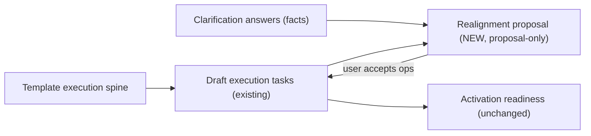

# Execution realignment from clarified scope (future, proposal-only)

> **Status:** Forward plan. **Not implemented.** Do not start until (a) the
> durable clarification schema is approved + shipped
> ([scope-clarification-schema-proposal.md](../specs/scope-clarification-schema-proposal.md))
> and (b) clarification answers are in real use.
>
> **Hard rule:** This layer must NOT rebuild or break the existing execution
> builder. The existing pieces stay authoritative:
> - draft execution: `QuoteLineExecutionTask` + current quote execution UI,
> - activation readiness: `apps/web/src/lib/quote-job-activation-readiness.ts`,
> - job materialization: `quote-job-activation-actions.ts`.

## Goal

Once a line has structured clarification facts (e.g. `service_feed = underground`,
`new_service_size = 200a`, `trenching_required = yes`), let the app **suggest**
adjustments to that line's draft execution plan — never silently apply them.

This closes the loop the user described: a basic execution "spine" lives on the
template, and job-specific clarifications mix in the deltas.

## Where it sits in the flow

Realignment reads facts + current draft tasks and emits **operations** the user
reviews. Accepted operations flow through the **existing** draft-execution
mutation paths — the realignment layer does not write tasks directly.

## Reuse, do not duplicate

The execution review proposal machinery already exists and is the right model
to mirror (review-then-apply, op-based, validated):

- proposal schema: `apps/web/src/lib/ai/quote-execution-review-proposal-schema.ts`
- validator: `apps/web/src/lib/ai/quote-execution-review-proposal.ts`
- review UI: `apps/web/src/components/quotes/quote-execution-review-*`

Plan: add **fact-driven rules** that emit the same `add_task` /
`patch_task_signals` operation shapes, so the existing review + apply path is
reused rather than rebuilt.

## Rule examples (data-driven, not hardcoded branches in UI)

| Fact | Suggested operation | Notes |
|------|--------------------|-------|
| `trenching_required = yes` | add task "Trenching for underground service" | skip if a trenching task already exists |
| `service_feed = underground` | add "Utility coordination (underground lateral)" | only if no equivalent task present |
| `new_service_size = 200a` | annotate / add material task "Order 200A service equipment" | feeds future parts list |
| `meter_relocation = yes` | add "Meter relocation coordination" | hard signal candidate |
| `permit_required = yes` and no permit task | add permit task | category PERMIT |

Rules should be **data/config**, keyed by canonical question/option keys, so new
trades do not require code branches — same discipline as the clarification
library itself.

## Guardrails for this layer

1. **Proposal-only first.** Emit operations; require explicit user acceptance.
2. **Idempotent suggestions.** Never re-suggest a task that already exists
   (match by canonical intent, not loose string equality).
3. **Respect user edits.** Never overwrite or delete user-authored tasks; only
   add or patch with consent.
4. **No activation coupling in v1.** Do not change
   `quote-job-activation-readiness.ts` semantics.
5. **Copy-on-activate intact.** Realignment runs on the quote draft; the job is
   still materialized by the existing activation path.

## Sequencing

1. Approve + ship durable clarification schema.
2. Adopt clarification answers in real quoting (validate they are trustworthy).
3. Add fact → operation rule config + a generator that emits existing
   execution-review operation shapes.
4. Surface suggestions in the existing execution review UI (or a sibling panel)
   as an optional "Realign from clarified scope" action.
5. Only later (if needed) consider parts/material list generation from the same
   facts.
